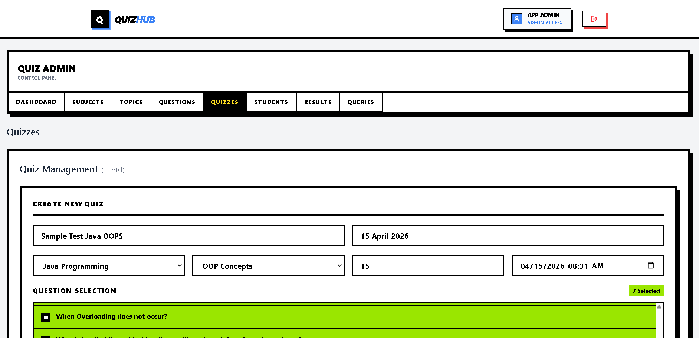
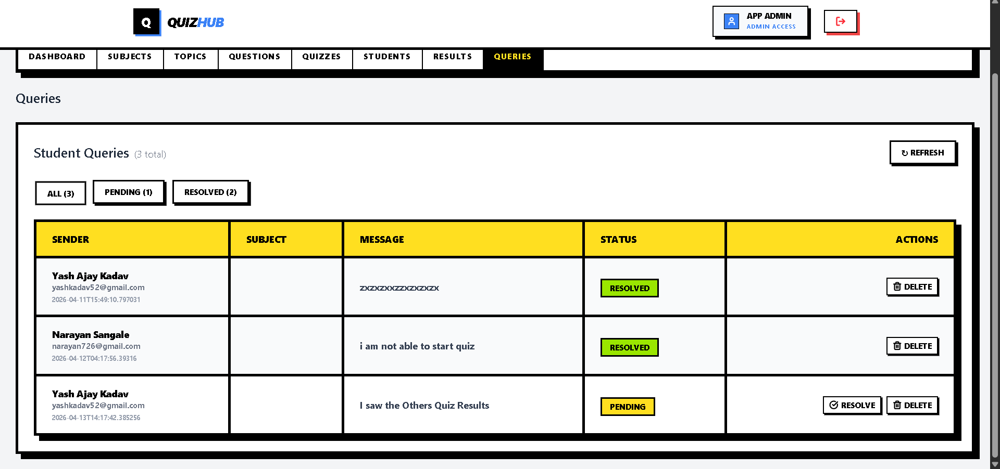
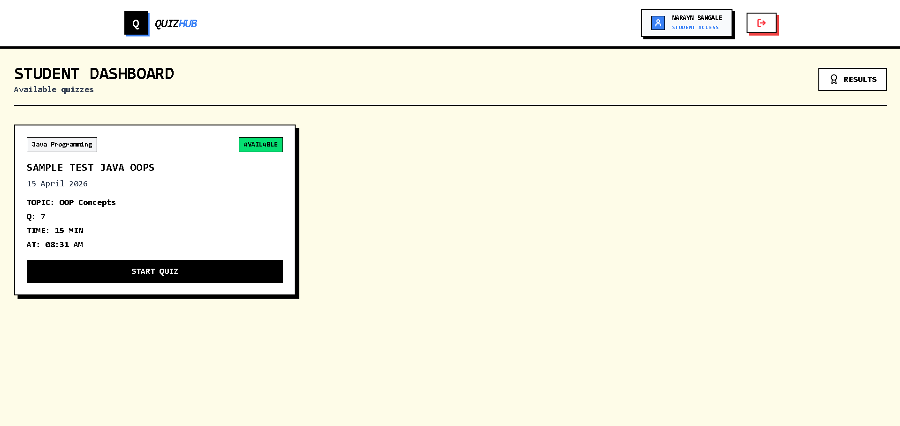
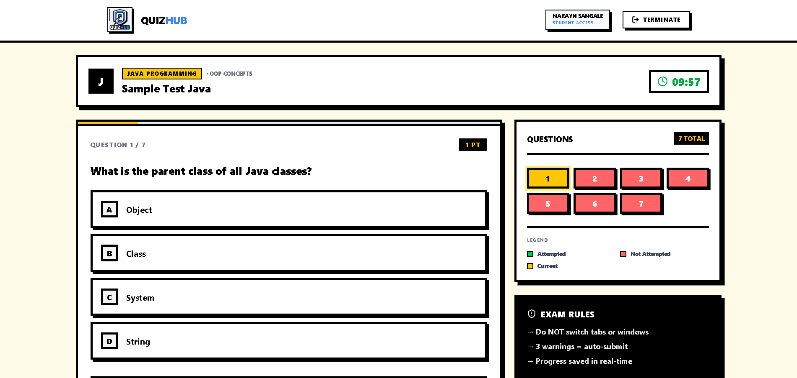
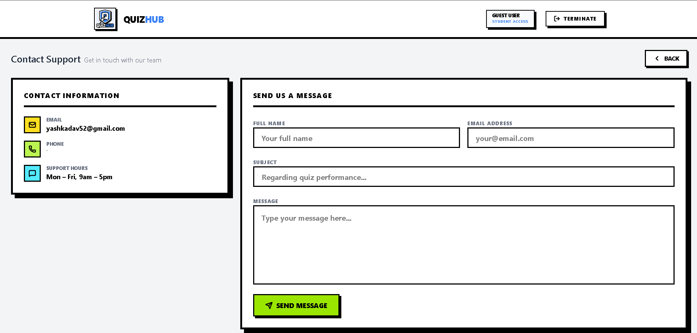
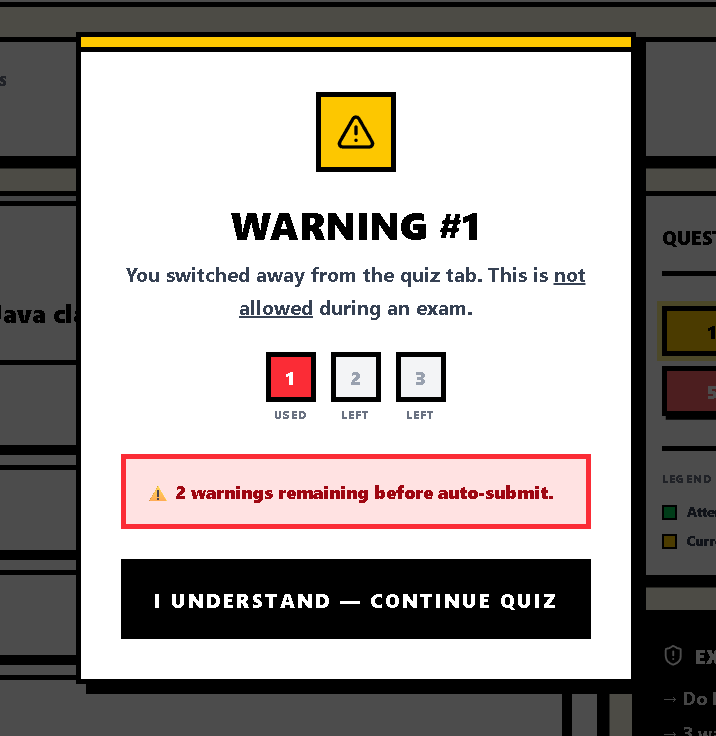
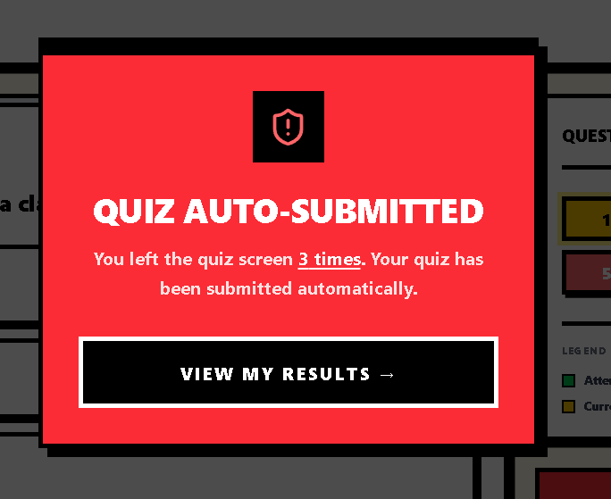

# Quiz System Frontend (React + Tailwind)

A responsive frontend application for an online quiz platform built using React and Tailwind CSS. It provides a smooth quiz-taking experience with real-time interaction, secure authentication, and basic anti-cheating features.

---

## 📸 Screenshots

> Store images inside a `/screenshots` folder in the root directory.

### Admin Dashboard



### Student Dashboard


### Quiz Interface


### Results Page


### Contact Page


### Warning Ui Page



---

## 📌 Overview

This frontend is designed to work with the Spring Boot Quiz Backend API. It allows students to attempt quizzes, track performance, and interact with a secure and responsive interface.

---

## 🛠️ Technology Stack

| Category | Technology |
| :--- | :--- |
| Library | React 18 |
| Styling | Tailwind CSS |
| Routing | React Router DOM v6 |
| Icons | Lucide React |
| API Client | Axios |
| Build Tool | Vite |
| State Management | React Hooks (useState, useEffect, useContext) |

---

## 🌟 Features

### Dashboard
- View available, upcoming, and completed quizzes  
- Dynamic filtering based on quiz status  

### Quiz System
- One question at a time interface  
- Real-time navigation between questions  
- Automatic submission after completion  

### Anti-Cheat Mechanism
- Detects tab switching or window focus loss  
- Displays warnings to user  
- Auto-submits quiz after 3 warnings  

### Authentication
- JWT-based login system  
- Tokens stored securely  
- Axios interceptors for API requests  

### UI & UX
- Responsive design (mobile + desktop)  
- Clean and consistent layout  
- Fast loading with Vite  

---

## 📂 Folder Structure

```
src/
├── api/            # Axios setup and API calls
├── components/     # Reusable UI components
├── pages/          # Application pages
├── context/        # Global state (Auth, Quiz)
└── assets/         # Images and styles
```

---

## 🌐 Backend Integration

This frontend connects to the backend API:

```
http://localhost:8081/api
```

---

## 🚀 Getting Started

### 1. Prerequisites
- Node.js (v18+)
- npm or yarn

### 2. Environment Setup

Create a `.env` file:

```env
VITE_API_BASE_URL=http://localhost:8081/api
```

### 3. Installation & Run

```bash
git clone https://github.com/yashajaykadav/quiz-system-frontend.git
cd quiz-system-frontend
npm install
npm run dev
```

App will run at:
```
http://localhost:5173
```

---

## 🧪 Testing

Currently manual testing is used. Future improvements may include unit and integration testing.

---

## 🚧 Future Improvements

- Add Redux or Zustand for better state management  
- Add timer-based quizzes  
- Improve accessibility (ARIA support)  
- Add dark mode support  

------

## 🤝 Contribution

Feel free to fork the project and submit pull requests for improvements.

---

## 📜 License

This project is licensed under the MIT License.
